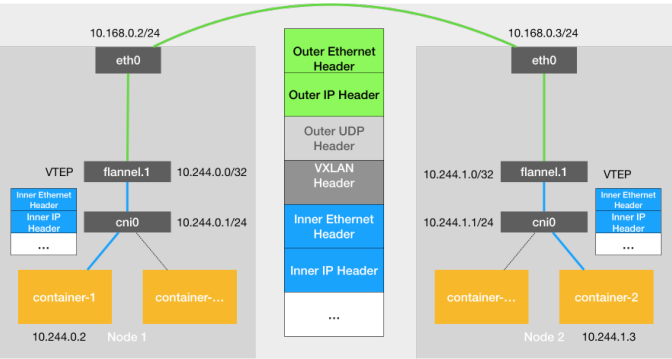
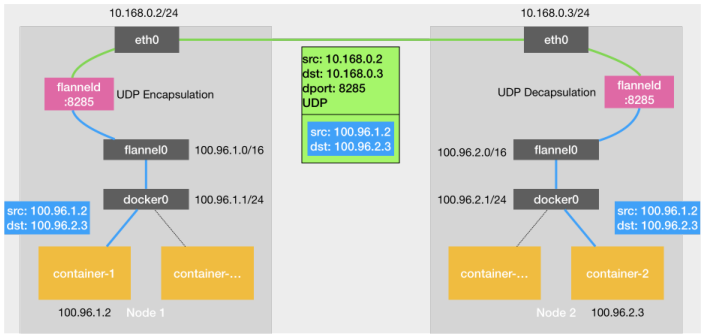
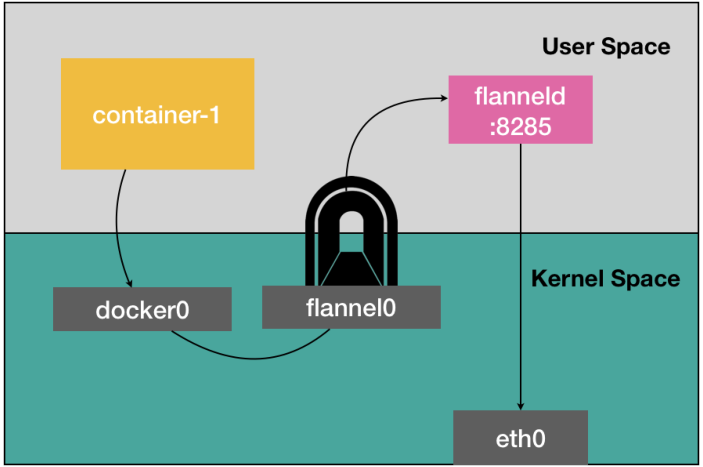
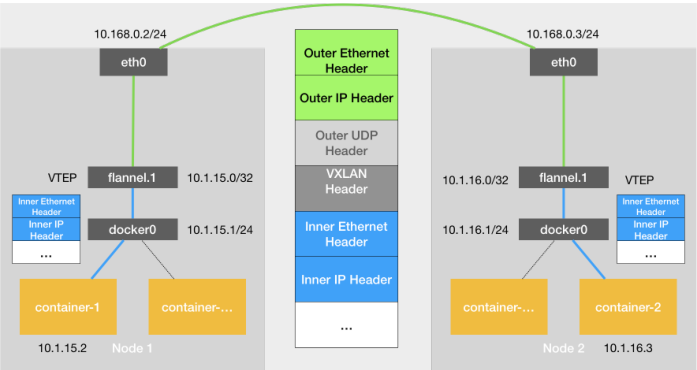

## 网络

网络方案：

​	覆盖式网络UDP、VxLan)	

​	Host-gw

VxLan

​	https://forum.huawei.com/enterprise/zh/thread-334207.html

可用软件

calico、Cilium、Weave、Flannet

#### kubernetes的网络插件：

​	1、如果没有指定network-plugin 则使用的默认的`noop` 插件，使用的是宿主机的docker的网络

​	2、使用network-plugin  指定的目录下的网络插件

​	3、Kubenet网络插件

#### CNI网桥

kubernetes 维护了一个单独的网桥来代替docker0,这个网桥就是CNI网桥，网络通信模式还是一样，只是之前和dockert0通信现在和CNI0通信

#### CNI网络插件

CNI只是接管所有由Kubernetes创建的容器，如果我们单独起一个容器，那么docker项目还是会把这个容器连接到docker0网桥上，

CNI的设计思想是：kubernetes在启动infra 容器后，就直接调用CNI的网络插件，为这个Infra容器的Network Namespace 配置符合预期的网络栈。

网络方式的实现：

1. 网络本身，实现容器的三层网络通信。
2. 配置容器的网络。kubelet的CNI接口调用。

#### flannel0

​	是一个TUN设备，在linux中，TUN设备时一种工作在三层的虚拟网络设备，TUN设备的功能非常简单，即在操作系统和用户应用程序之间传递IP包，

#### VXLAN

是 Linux 内核本身就支持的一种网络虚似化技术是内核的一个模块。所以说，VXLAN 可以完全在内核态实现上述封装和解封装的工作，从而通过与前面相似的“隧道”机制，构建出覆盖网络（Overlay Network）

实在现有三层网络上覆盖一层虚拟的，有内核VXLAN模块负责维护的二层网络，使得连接在这个VXLAN二层网络上的”主机,容器“之间，可以像一个局域网里那样自由通信

1. 